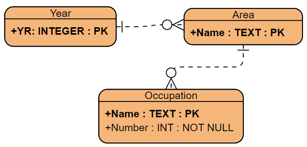

# Coursework 2 Markdown
## Requirements
### Explanation of the choice of techniques
- For eliciting, I will use brainstorming. Since we cannot involve others with the coursework, we are restricted only to methods which can be done individually. Amongst these methods I have decided to use brainstorming since it is a simple and efficient way to consider many ideas simultaneously and evaluate which ones should be kept for the following sections.

- For documenting, I will use user stories. This format will help me focus on the user and how they would react to each requirement keeping the requirements more focussed on my target audience. It also helps document why each requirement is necessary which will help with prioritisation as well.

- For prioritising, I will use MoSCoW. This format is good because it clearly ranks which requirements are the most important but also considers which requirements are good but impractical to implement considering factors like time or budget needed compared to the value the function would provide.

### Prioritised requirements
My APP2 is a data visualisation dashboard

As a politician, I want to be able to visually see data about the areas I represent so that I can gain a better understanding of the demographics.

Acceptance criteria:
- The data from the previous coursework should be used to generate graphs

- The graphs should be colour coded to improve clarity to the user

As a professional, I want to be able to navigate the interface quickly so that so that I can minimise wasted time 

As a computer novice, I want the interface to be simple and intuitive with items and their functions to be clearly visible and intuitive so that I am able to easily find the options I need.

Acceptance criteria:
- All relevant options should be visible with hidden submenus being used only when necessary
- Icons and labels should be clear to a user with limited computer experience. Such as checkmarks and arrows.
- The user interface should have buttons visible on screen for necessary interactions and avoid using gesture commands or keyboard shortcuts.

As a user with weaker eyesite, I want the interface to have a large easy to read font and big icons, so that I am able to navigate the app without eye strain.

Acceptance criteria:
- Sans serif fonts should be used with a large font size so that text is easy to read
- Icons should be large, distinct from one another, and use flat colours with no small details so that icons are easy to differentiate.
- Text and background elements should have contrasting colours to increase clarity

As a user who isn't a mathematician, I want any graphs to be clear in their meaning so that I can tell at a glance the general trend of the data.

Acceptance criteria:
- Different areas of the graph should be visible on the same graph so it is clear how the number of people from each area in each category compare to one another
- The amount of information on one graph should not be overwhelming, so I will keep each year on a separate graph to limit the amount of information on each graph
- Both graphs should be visible at the same time so that the user can see how the data compares between each year

As a user with older hardware, I want the app to use minimal system resources so that I am able to use the site without slowdown and long load times.

Acceptance criteria:
- Unnecessary graphics and animations should not be used, simple text and graphs should follow the other criteria and be intuitive but function and computational efficiency should be prioritised over aesethetics

- The app should function work across different operating systems and hardware configurations

As a politician who has a basic understanding of statistics, I want the data to be presented in small easy to understand sections so that I can avoid becoming overwhelmed.

Acceptance criteria:
- Different graphs should be togglable so that the user only needs to see the information they need

- The comparison between years should be its own graph separate from the other two to avoid overwhelming the user

| Requirement | Priority |
| ----------- | ----------- |
| Colour coded graphs | Must have |
| Minimal use of submenus | Should have |
| Large font and icons | Must have |
| On screen prompts for options | Must have |
| Contrasting Colours | Should have |
| Multiple areas in each bar | Should have |
| All graphs visible simultaneously | Must have |
| No unnecessary graphics/animations | Should have |
| App should function across different operating systems | Should have |
| Togglable graphs | Should have |
| Separate comparison graph | Must have |
## Design
### Interface design

### Application design
In my design I've chosen a simple layout with all necessary information visible at once. This is so that the user won't get lost or confused searching through different pages to find what they're looking for.

I've included a toggle at the top of the page to clearly show what options are avaiable to user. I've also made the deliberate decision to always have at least 1 checkbox checked by default so that the user will never click show and have a blank graph appear.

I have included a dropdown menu for the first two graphs. I did this to avoid the dashboard being cluttered by too many options when first opened. But, to try and help guide the user, I included a large arrow which responds to the dropdowns being opened to try and visually convey that there are more options avaiable.

In the framework screenshots, I showed different areas selected for the first two graphs, this is to visually convey that the user can select options independantly for each graph.

In the final screenshot, it is shown that the comparison graph does not have a dropdown menu. This is because it just shows a comparison between the other 2 graphs which the user has already configured to their liking. I decided that not having a dropdown would avoid misleading the user into thinking the third graph was independant from the other two.

For the comparison graph, I could have designed it to be independant from the other two, however this would require it to have its own dropdown menu with double the amount of options that the other graphs had. I decided to avoid this as having that many options could be confusing to navigate.
### Database design

For this database, normalising the data is not necessary since I already cleaned the data prepartion step. Due to the nature of my data, I only needed 3 entities in the database. There are 2 years, the data for which is stored in 2 separate CSV files. Within each year there is data for several areas, and each area has several occupations, each occupation has a number stating how many workers there are in that occupation for that area for that year.